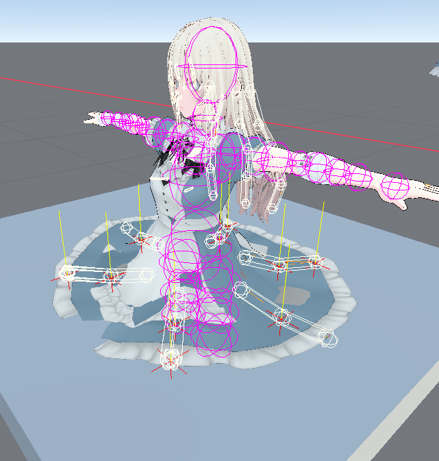
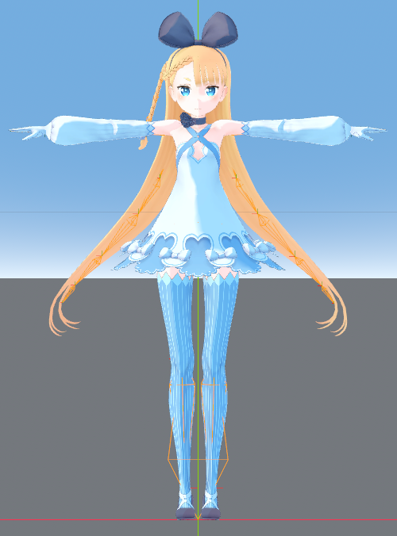
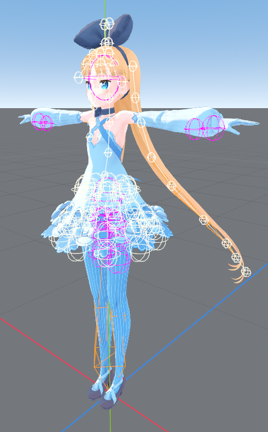

  

# godot-vrm

> [!IMPORTANT]
> An active fork and continuation of the excellent [V-Sekai/godot-vrm](https://github.com/V-Sekai/godot-vrm), providing ongoing maintenance and major performance upgrades. Maintained by **[AzPepoze](https://github.com/AzPepoze)**.

VRM importer, exporter, and runtime spring bone physics for **Godot Engine 4.3+**. Includes a standalone MToon shader.

---

## Contents

- [What is VRM?](#what-is-vrm)
- [What this fork improves](#what-this-fork-improves)
- [Installation](#installation)
- [Showcase](#showcase)
- [Features Status](#features-status)
- [Import Options](#import-options)
- [Credits](#credits)

---

## What is VRM?

- **[VRM](https://vrm.dev/en/)**: A 3D avatar format based on glTF 2.0 that standardizes bones, expressions, and physics.
- **[VRoid Studio](https://vroid.com/en/studio)**: A free tool to easily create your own custom VRM avatars.

---

## What this fork mainly improves

- **C++ Physics**: Spring bones and node constraints are rewritten in C++ (GDExtension) for massive performance gains.
- **Wind Support**: Added directional and turbulent wind simulation for spring bones.
- **Environment Collision**: Spring bones can now collide with Godot's physics bodies.
- **Editor Gizmos**: Visualize spring bone colliders and radius directly in the editor.
- **Group Multipliers**: Scale hit radius for specific spring bone groups (like Hair or Skirts) per-instance.
- **Shared Settings**: Optionally share a single `VRMSettings` resource across multiple avatars to synchronize global wind, gravity, and collisions, or keep them completely unique per character.

---

## Installation

1. Copy `addons/vrm` into your project's `addons/` — **do not rename**
2. Copy `addons/mtoon` into `addons/mtoon` — **do not rename**
3. Enable both in **Project Settings → Plugins → VRM** and **mtoon**

---

## Showcase

### Spring Bone & Environment Collision

|                      VRM 0.0 Collision                       |                      VRM 1.0 Collision                       |
| :----------------------------------------------------------: | :----------------------------------------------------------: |
|  |  |

Spring bones can collide with two types of objects:
- **Body Colliders**: The character's own internal VRM colliders.
- **Environment Collision**: Godot's external physics bodies (can be toggled in settings).

In the debug images above:

- **White wireframe**: Spring bone collision radius
- **Purple wireframe**: VRM character body colliders
- **Yellow line**: Orthogonal surface normal at the hit point
- **Red X**: The exact point of collision with the environment

> [!WARNING]
> **Known Issue:** Spring bones may occasionally pass through colliders (clipping). I honestly suck at collision algorithms, so if you are a math wizard, PRs to help improve collision stability are very much needed and welcome!

### VRM Import & Spring Bone Gizmos

|     VRM 0.0 Import      |     VRM 1.0 Import      |
| :---------------------: | :---------------------: |
|  |  |

|                    Capsule Gizmo                    |                      Line Circle Gizmo                      |
| :-------------------------------------------------: | :---------------------------------------------------------: |
|  |  |

---

## Features Status

### Core VRM Support

| Feature                 | Status | Details                                                     |
| ----------------------- | :----: | ----------------------------------------------------------- |
| VRM 0.0 Import          |   ✅   |                                                             |
| VRM 1.0 Import          |   ✅   |                                                             |
| VRM 1.0 Export (`.vrm` / `.glb`) |   ⚠️   | Exports metadata, MToon, and node constraints, but humanoid bones/expressions are WIP |
| Metadata                |   ✅   | License, screenshot parsing                                 |

### Spring Bones (`VRMC_springBone`)

| Feature                   | Status | Details                                                                |
| ------------------------- | :----: | ---------------------------------------------------------------------- |
| Core Physics              |   ✅   | High-performance C++ GDExtension physics                               |
| Wind Support              |   ✅   | Direction, strength, turbulence, frequency                             |
| Environment Collision     |   ✅   | Capsule queries against Godot's physics environment. Can be toggled.   |
| Group Multipliers         |   ✅   | Per-instance hit radius scaling for specific groups (e.g. Hair, Skirt) |
| Editor Gizmos             |   ✅   | Visualizes spring bone colliders and radius in the 3D viewport         |
| `.gltf` Standalone Export |   ⚠️   | Spring bones are not currently exported to glTF        |

### Materials & Shading

| Feature                       | Status | Details                |
| ----------------------------- | :----: | ---------------------- |
| `VRMC_materials_mtoon`        |   ✅   | Standard MToon shading |
| `VRMC_materials_hdr_emissive` |   ✅   | HDR emissive textures  |

### Animation & Retargeting

| Feature                | Status | Details                                                           |
| ---------------------- | :----: | ----------------------------------------------------------------- |
| `humanoid`             |   ✅   | `SkeletonProfileHumanoid` via `%GeneralSkeleton`                  |
| `expressions`          |   ✅   | Blend shape / material animation tracks                           |
| `firstPerson`          |   ⚠️   | Head hiding supported via import options                          |
| `lookAt`               |   ⚠️   | Generates animation tracks (app must use `BlendSpace2D` manually) |
| `VRMC_node_constraint` |   ⚠️   | Has known issues with retargeting                                 |

---

## Import Options

Available in the Import dock when selecting a `.vrm` file:

- **Head Hiding Method**: `ThirdPersonOnly` / `FirstPersonOnly` / `FirstWithShadow` / `Layers` / `LayersWithShadow` / `IgnoreHeadHiding`
- **First/Third Person Layers**: Render layer masks for `Layers` mode
- **Remove End Bones**: Strips empty end-bone nodes from the skeleton

---

## Icons

-  **VRM Instance**
-  **VRM Constraint**
-  **VRM Constraint Applier**

---

## Credits

Originally created by [V-Sekai](https://v-sekai.org/about). This fork and continuation is maintained by [AzPepoze](https://github.com/AzPepoze).

**Original Contributors:**

- [aaronfranke](https://github.com/aaronfranke) and [The Mirror team](https://www.themirror.space/)
- [fire](https://github.com/fire)
- [TokageItLab](https://github.com/TokageItLab)
- [lyuma](https://github.com/lyuma)
- [SaracenOne](https://github.com/SaracenOne)
